# SafeLine WAF Home Lab

## 1. Introduction

### 1.1 Overview

This project documents the build of a home cybersecurity lab centered around **SafeLine WAF**, an open-source Web Application Firewall. The lab pairs a deliberately vulnerable web application (**DVWA** — Damn Vulnerable Web App) hosted on an Ubuntu Server with a Kali Linux attack box, and places SafeLine WAF in front of the application as a reverse proxy to detect and block malicious traffic such as SQL injection and HTTP flood attacks.

The idea for this lab came from [The Social Dork](https://www.youtube.com/@thesocialdork1133) on YouTube, and was adapted and rebuilt from scratch in a personal VMWare lab.

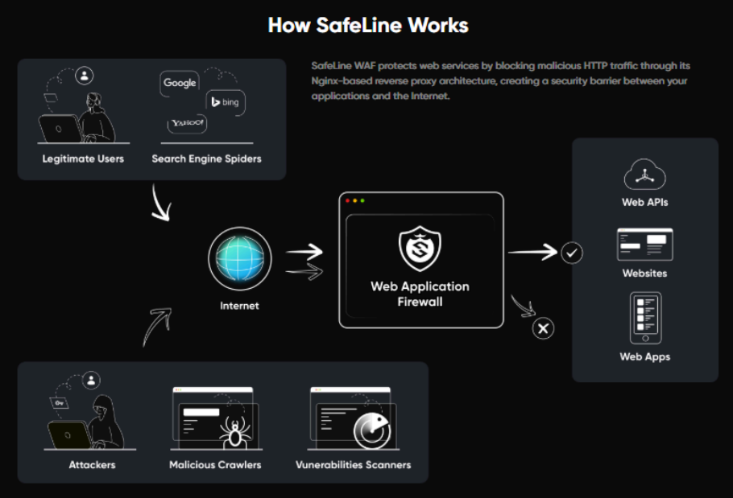

SafeLine sits in front of the web application as an Nginx-based reverse proxy: legitimate traffic (users, search engines) is passed through to the backend, while malicious traffic (attackers, malicious crawlers, vulnerability scanners) is inspected and blocked before it ever reaches the application.

### 1.2 Purpose and Goals

- **Stand up a vulnerable target:** Deploy DVWA on Ubuntu Server as a realistic attack surface.
- **Simulate an attacker:** Launch a SQL injection attack against DVWA from Kali Linux.
- **Deploy a WAF in front of the app:** Install and configure SafeLine WAF as a reverse proxy protecting DVWA.
- **Prove the defense works:** Confirm SafeLine detects and blocks the SQL injection attempt.
- **Go beyond the basics:** Layer on additional SafeLine protections — HTTP flood defense, an authentication gateway, and custom IP deny rules.

## 2. Prerequisites

### 2.1 Hardware Requirements

- Host machine capable of running two virtual machines simultaneously.
- At least 8 GB of RAM and 50 GB of free disk space recommended.

### 2.2 Software Requirements

- **VirtualBox** — virtualization platform used to host both VMs.
- **Kali Linux** — the attacker machine.
- **Ubuntu Server (22.04 LTS)** — hosts DVWA and SafeLine WAF.
- **DVWA (Damn Vulnerable Web App)** — the intentionally vulnerable target application.
- **SafeLine WAF** — the open-source web application firewall protecting DVWA.

### 2.3 Prior Knowledge

- Basic familiarity with creating and configuring VMs in VirtualBox.
- Comfort with the Linux command line (installing packages, editing config files).
- Foundational understanding of web application vulnerabilities and how a WAF fits into a security stack.

## 3. Lab Environment Setup

### 3.1 Install VirtualBox

Download and install VirtualBox for the host OS from the [official downloads page](https://www.virtualbox.org/wiki/Downloads). Installing the Extension Pack is optional but adds USB 2.0/3.0 support.

### 3.2 Create the Kali Linux VM

Download the [Kali Linux ISO](https://www.kali.org/get-kali) and create a new VM in VirtualBox:

- **Type:** Linux — **Version:** Debian (64-bit)
- **Memory:** 2 GB minimum
- **Disk:** ~20 GB, dynamically allocated

Attach the ISO and run through the graphical installer.

### 3.3 Create the Ubuntu Server VM

Download [Ubuntu Server 22.04 LTS](https://ubuntu.com/download/server) and create a second VM:

- **Type:** Linux — **Version:** Ubuntu (64-bit)
- **Memory:** 2 GB minimum
- **Disk:** ~20 GB, dynamically allocated

Optionally install OpenSSH during setup for remote access to the VM.

### 3.4 Enable Bridged Networking

To let both VMs reach each other and the host on the same network, set the network adapter on each VM to **Bridged Adapter**, pointing at the host's active network interface (Ethernet or Wi-Fi). Once `net-tools` is installed (Section 4.1), `ifconfig` can be used to confirm each VM's assigned IP.

### 3.5 Install Guest Additions (Optional)

Guest Additions improve display resizing, clipboard sharing, and shared folders:

```bash
sudo apt-get update
sudo apt-get install build-essential dkms linux-headers-$(uname -r)
sudo mount /dev/cdrom /media/cdrom
sudo /media/cdrom/VBoxLinuxAdditions.run
```

Restart the VM after installation.

## 4. Ubuntu Server Configuration

### 4.1 Initial Updates and Utilities

```bash
sudo apt-get update
sudo apt-get upgrade -y
sudo apt-get install -y net-tools
sudo apt-get install -y openssl
```

### 4.2 Install the LAMP Stack

```bash
sudo apt-get install -y apache2 php php-mysql mysql-server
sudo mysql_secure_installation
```

### 4.3 Install and Configure DVWA

```bash
cd /var/www/html
sudo apt-get install -y git
sudo git clone https://github.com/digininja/DVWA.git
sudo chown -R www-data:www-data DVWA
sudo chmod -R 755 DVWA
```

Update `DVWA/config/config.inc.php` with the database credentials, then create the matching database and user in MySQL:

```sql
CREATE DATABASE dvwa;
CREATE USER 'dvwa_user'@'localhost' IDENTIFIED BY 'p@ssw0rd';
GRANT ALL ON dvwa.* TO 'dvwa_user'@'localhost';
FLUSH PRIVILEGES;
```

Finally, browse to `http://<Ubuntu-IP>/DVWA/setup.php` and click **Create/Reset Database** to initialize DVWA.

### 4.4 Move DVWA to Port 8080

Apache listens on port 80 by default. To free up port 80/443 for SafeLine WAF later, DVWA is moved to port 8080:

```bash
sudo nano /etc/apache2/ports.conf   # change "Listen 80" to "Listen 8080"
sudo nano /etc/apache2/sites-available/000-default.conf   # change <VirtualHost *:80> to <VirtualHost *:8080>
sudo systemctl restart apache2
```

DVWA is now reachable at `http://<Ubuntu-IP>:8080/DVWA`.

### 4.5 Seed Custom Data for Testing

A throwaway table with sample credentials gives the SQL injection demo something concrete to extract:

```sql
USE dvwa;
CREATE TABLE test_users (
    id INT NOT NULL AUTO_INCREMENT,
    username VARCHAR(50) NOT NULL,
    password VARCHAR(50) NOT NULL,
    PRIMARY KEY (id)
);
INSERT INTO test_users (username, password) VALUES
  ('alice', 'alice123'),
  ('bob', 'bob123'),
  ('admin', 'admin123');
```

## 5. DNS Resolution Setup

### 5.1 Local Resolution via `/etc/hosts`

On both the Ubuntu Server and Kali VMs, map a friendly hostname to the Ubuntu server's IP:

```bash
sudo nano /etc/hosts
# <Ubuntu-IP>   dvwa.local
```

DVWA is then reachable from Kali at `http://dvwa.local:8080/DVWA`.


## 6. Creating a Self-Signed SSL Certificate

A self-signed certificate is generated on the Ubuntu server so SafeLine can terminate HTTPS in front of DVWA.

**Generate the private key:**

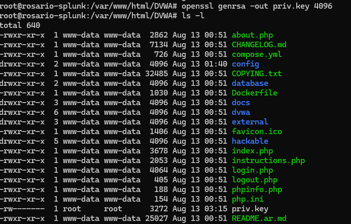

**Create the certificate signing request (CSR):**

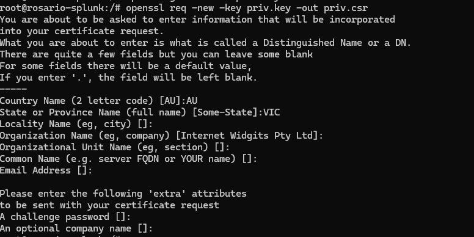

**Self-sign the certificate and verify it:**

```bash
openssl x509 -req -days 365 -in priv.csr -signkey priv.key -out priv.crt
```

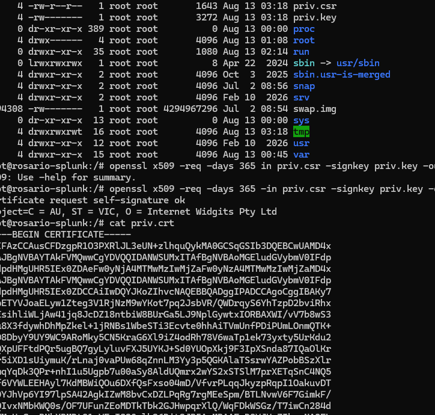

The resulting `priv.crt` and `priv.key` files are what get imported into SafeLine in the next step.

## 7. Installing and Configuring SafeLine WAF

### 7.1 Automatic Deployment

SafeLine ships with a one-line installer. On the Ubuntu Server:

```bash
bash -c "$(curl -fsSLk https://waf.chaitin.com/release/latest/manager.sh)" -- --en
```

The installer pulls the SafeLine container images, starts all services, and prints an initial admin username and password along with the management URL (port **9443** by default):

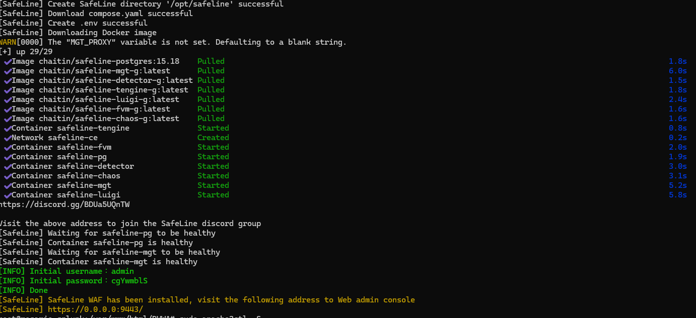

Once the containers are healthy, the web console is available at `https://<Ubuntu-IP>:9443/login`:

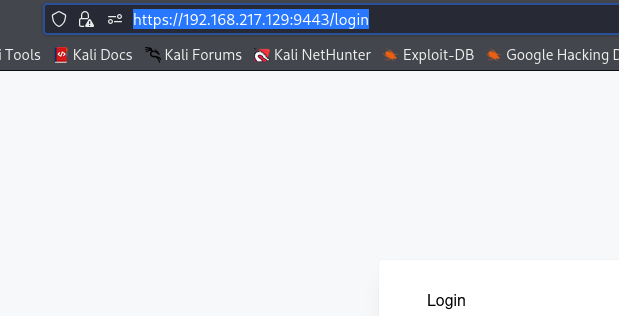

### 7.2 Importing the Self-Signed Certificate

In the SafeLine console, under the SSL certificate section, upload the `priv.crt` and `priv.key` files generated in Section 6:

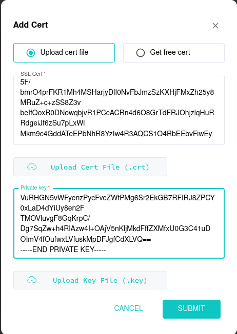

Once uploaded, the certificate appears in the certificate list and is ready to attach to an application:

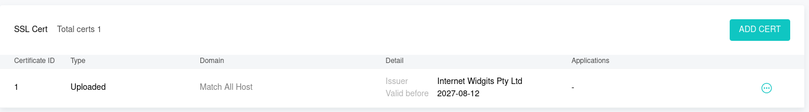

### 7.3 Onboarding the DVWA Application

A new application is added in SafeLine pointing at DVWA:

- **Domain:** `dvwa.local` (or the domain configured in Section 5)
- **Backend (reverse proxy) URL:** `http://<Ubuntu-IP>:8080`
- **Listening port:** 443 only — port 80 is removed so all traffic is forced over HTTPS
- **SSL Certificate:** the one imported in Section 7.2

With the application onboarded, DVWA is served through SafeLine over HTTPS:

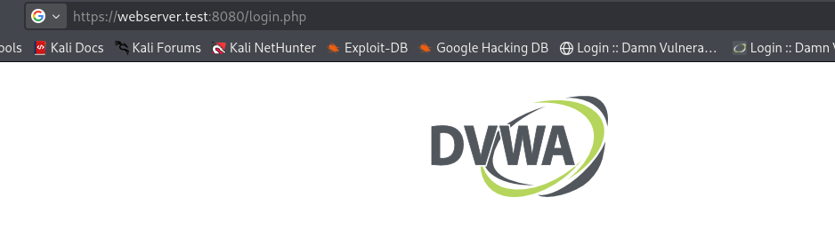

The application now shows up in the SafeLine dashboard, listening on 443/HTTPS with defense enabled:

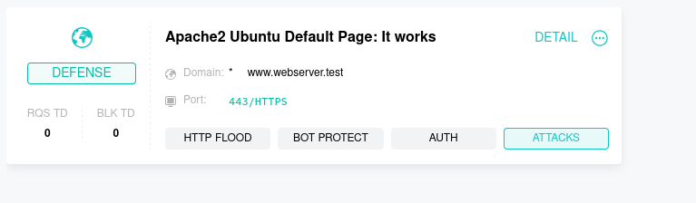

## 8. Demonstrating SQL Injection from Kali Linux

### 8.1 Launching the Attack

1. From Kali, browse to `http://dvwa.local/` — traffic is transparently redirected through SafeLine over HTTPS.
2. Log in to DVWA (default credentials: `admin` / `password`, unless changed).
3. Set the DVWA security level to **Low** under the Security tab.
4. Navigate to the SQL Injection module and submit a classic payload, e.g. `admin' OR '1'='1`.

### 8.2 Observing SafeLine WAF Protection

With SafeLine sitting in front of DVWA, the malicious SQL injection payload is inspected before it reaches the backend. SafeLine's attack logs show the request being flagged and blocked, confirming the WAF is actively protecting the application rather than passing traffic through unfiltered.

## 9. SafeLine WAF Advanced Configurations

### 9.1 HTTP Flood Defense

A rate-limiting rule is configured under **HTTP Flood > Rate Limiting**: if a source sends more than a set number of requests within a time window, it is temporarily blocked.

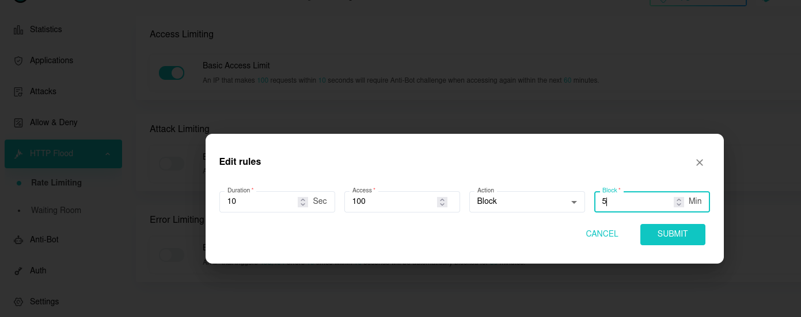

Flooding the application from Kali (e.g. with `ab` or `siege`) past the configured threshold triggers the block, and the client is served an **Access Forbidden** page for the configured penalty duration:

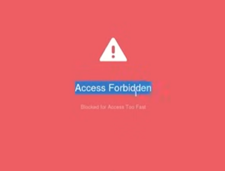

### 9.2 Authentication Sign-In

SafeLine can gate an application behind its own authentication layer before requests ever reach the backend. Enabling **Auth** on the DVWA application requires visitors to authenticate with SafeLine first, with the option to scope the challenge to specific conditions (e.g. only challenge a specific source IP):

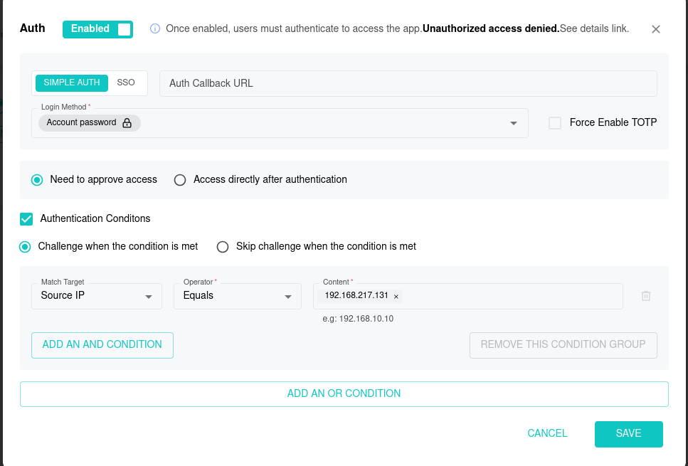

### 9.3 Custom Deny Rules (Blocking the Kali IP)

To demonstrate manual IP blocking, a custom **Deny Rule** is created under **Allow & Deny**, matching the Kali VM's source IP and denying it outright:

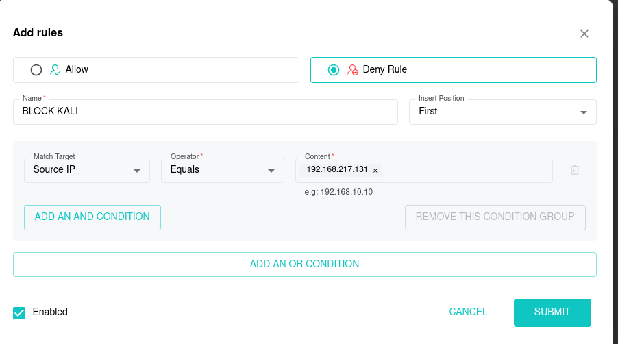

Once saved, any request from that IP is rejected by SafeLine before it reaches DVWA.

## 10. Conclusion and Further Exploration

This lab stood up a complete, self-contained home environment for studying web application security: a vulnerable application (DVWA), an attacker machine (Kali), and a web application firewall (SafeLine) defending the application in real time. Along the way it covered certificate management, SQL injection, HTTP flood defense, authentication gating, and manual IP blocking.

Possible next steps:

- Add more vulnerable targets (e.g. OWASP Juice Shop) to broaden the attack surface.
- Test additional attack classes — XSS, file inclusion, command injection — against SafeLine's defenses.
- Feed SafeLine's logs into a home SIEM (e.g. Wazuh) or pair it with an IDS/IPS for a fuller detection-and-response pipeline.
- Keep Ubuntu, Kali, and SafeLine patched and updated as part of routine lab maintenance.

## 11. References

- [The Social Dork — YouTube channel](https://www.youtube.com/@thesocialdork1133)
- [DVWA (Damn Vulnerable Web App)](https://github.com/digininja/DVWA)
- [SafeLine WAF](https://waf.chaitin.com/)
